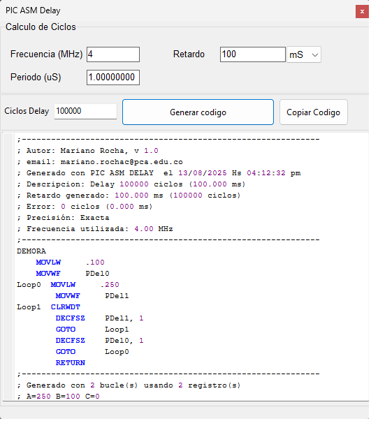

# PIC ASM Delay Generator

## Herramienta para generar rutinas de retardo en ensamblador para microcontroladores PIC.

## Características
- Precisión exacta o aproximada según configuración.
- Compatible con frecuencias entre 1 MHz y 20 MHz.
- Genera código con 1, 2 o 3 bucles anidados.
- Incluye encabezado con fecha, error y requerimientos.

## Uso
1. Ejecuta el programa.
2. Ingresa la frecuencia del microcontrolador (MHz).
3. Ingresa el retardo deseado (ms).
4. Copia el código generado en tu proyecto ASM.

## Descarga
[Descargar ejecutable](https://github.com/tuusuario/PIC-ASM-Delay-Generator/releases)

## Autor
Mariano Rocha - Compartiendo conocimiento técnico con precisión y claridad.
## Mail
mariano.rochac@pca.edu.co
## Software
 

